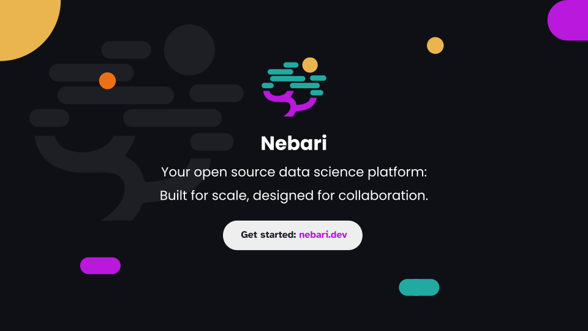

# Welcome to Nebari! 👋

<!-- TODO: Verify and update all the links -->

---

📖 Looking to learn about Nebari? Check out [our documentation](https://www.nebari.dev/).

🪴 Want to report a bug or have a new feature request? [Open an issue](https://github.com/nebari-dev/nebari/issues/new/choose).

💬 Have a question about using Nebari? Ask on [our community forum](https://github.com/orgs/nebari-dev/discussions).

💎 Wish to contribute to Nebari? Check out [our contributing guidelines](https://www.nebari.dev/community/#how-to-contribute).

✨ Curious what we're working on? Check out [our roadmap](https://github.com/nebari-dev/governance).

---

<!-- We can pin the following repositories, in order:
- nebari-dev/nebari
- nebari-dev/nebari-docs
- nebari-dev/nebari-demo
- nebari-dev/nebari-design
- nebari-dev/governance
- nebari-dev/nebari-docker-images -->
